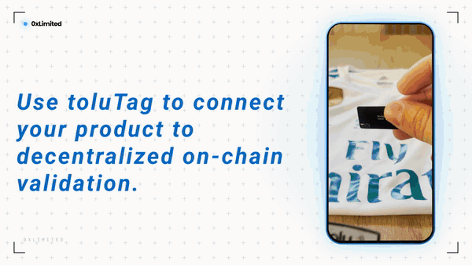

# 0xLimited

Smart contracts for **hardware-bound NFT collections**: ERC-721 tokens that can
only be minted, paired and transferred by the physical product they belong to.



> **0xLimited runs on toluTag.** Every collection here is built around
> [toluTag](https://github.com/mwbpNFTechnology/toluTag), the NFC tag that carries an NXP SE05x secure
> element with a secp256k1 key generated on-chip and never exported. The tag is
> not an accessory to the token, it is the thing the token answers to. Without a
> tag there is nothing to register, nothing to mint against, and no way to move
> a token. Provision the tags first with the toluTag app or CLI, then deploy a
> collection for them.

Each product carries its own tag. The tag's Ethereum address is registered on
the collection's allowlist before the drop, and from then on the token follows
the object: minting requires a fresh signature from that tag, and so does every
transfer. A token cannot be moved by a wallet alone, and a tag cannot mint
twice.

This repository holds the Solidity side. The other half of the system is
[0xLimited.com](#0xlimitedcom-build-and-sell-a-collection), the ecosystem's
website, where a brand builds, deploys and sells a collection from its own
wallet in the browser, with no Hardhat and no private key on a server. Both are
described below.

---

## How a collection works

A collection is three contracts, deployed in order, each one immutable once it
is wired:

| Contract | Role |
|---|---|
| `HybridToluTagValidationLogic` | The allowlist and the signature checker. Holds tag key to UUID, tag key to reserved token ID, and the freshness window. |
| `HybridToluTagMetadataRandom` / `...Reserved` | Builds `tokenURI()`. Bound to the NFT at deploy and never replaceable. |
| `ToluTagProduct` / `ToluTagProductPaid` | The ERC-721 itself. Its constructor wires the other two. |

The NFT's constructor calls `setNftContract` on both dependencies, and each one
accepts that call exactly once. After deployment the three are permanently
bound: the metadata contract is `immutable`, so a collection can never be
repointed at a different renderer.

### The signed message

Everything the chip signs uses one three-part format:

```
0xAddress_0xUUID_uint256
```

`_parseMessage` in the validation contract reads it for both purposes:

- **Registration** (`0xPubKey_0xUUID_tokenID`) : the creator's allowlist entry.
  `tokenID` is `0` for a random collection, or the reserved token ID.
- **Minting / transferring** (`0xSender_0xUUID_timestamp`) : what the chip
  actually signs at the counter.

Validation reconstructs the EIP-191 hash, recovers the signer with `ecrecover`
at `v = 27`, falling back to `28`, and then checks three things: the recovered
address is the claimed tag key, the tag key is on the allowlist with a matching
UUID, and the timestamp is neither in the future nor older than
`signatureValidTimeRange` seconds. The signed message names the sender, and
`mint` requires `msg.sender == result.signatureAddress`, so a captured signature
cannot be used by anyone else.

### Random vs reserved

`collectionType` is fixed at deploy and decides both minting and metadata.

**Random (`0`)** : every physical item is identical, so it does not matter which
token ID a buyer gets. Tags are registered with `tokenID = 0`, and the token ID
is drawn at mint time from a shuffled matrix (`_getRandomTokenId`) using
`block.prevrandao`. All tokens share one trait set, passed to the metadata
contract as constructor arguments.

**Reserved (`1`)** : the items differ, so token ID 7 must be *that* item. Each
tag is registered with its own token ID, checked to be unique and within
`maxSupply`, and stored both ways so metadata can name a reserved token's tag
before it is minted. Traits live off-chain, one folder per token:

```
<baseMediaURI><tokenId>/                  media
<baseMediaURI><tokenId>/attributes.json   traits
```

Using an `ipfs://` CID as the base is what keeps that half honest: the CID hashes
the whole folder tree, so traits cannot change unless the owner changes the URI
on-chain, in public, through `updateCollectionInfo`.

In both variants the default metadata fields are built on-chain and returned
base64-encoded as a data URI. There is no metadata server.

### Transfers are gated, not free

Standard ERC-721 movement is disabled outright. `approve`,
`setApprovalForAll`, `transferFrom` and all three `safeTransferFrom` overloads
revert. The only ways a token moves are:

- `transferWithSignature(to, tokenId, r, s, tagKey, message)` : the caller must
  own the token, the chip must match the token, and the signature must be fresh.
- A direct transfer to the collection owner, kept as a recovery path.

After any transfer, `_afterTokenTransfer` clears the paired flag and records the
new owner. The new holder re-pairs by tapping the chip and calling
`pairProduct`, which is what makes "this token is currently with its physical
item" a state the chain can actually assert rather than assume.

Royalties are ERC-2981, paid to `owner()`, in basis points.

### Paid collections

`ToluTagProductPaid` adds a two-step sale on top of the same model. A buyer
calls `purchase(quantity, PayWith.Native | PayWith.USDC)` to pay in advance,
then mints against that allowance later, when they have the tag in hand.

- Two independent unit prices, native coin and USDC. A price of `0` switches
  that currency off, so a drop can take ETH, USDC, or both.
- `quote()` tells a frontend the exact `msg.value` or approval amount.
- `maxPerWallet` caps purchases (`0` = unlimited); `totalPaid` can never exceed
  `maxSupply`.
- The sale starts **closed**. The owner opens it with `setSaleActive(true)`.
- `withdrawNative` / `withdrawToken` move proceeds out, owner only.

`setPaymentConfig` can correct the USDC address afterwards, which matters
because it is a network-specific constructor argument.

---

## Repository layout

```
contract/
├── contracts/
│   ├── nft/
│   │   ├── HybridToluTagNFT.sol        abstract: pairing, gated transfers, random IDs
│   │   ├── HybridToluTagNFTPaid.sol    abstract: the above + prepaid sale
│   │   ├── ToluTagProduct.sol          deployable standard collection
│   │   └── ToluTagProductPaid.sol      deployable paid collection
│   ├── validation/HybridToluTagValidationLogic.sol
│   ├── metadata/HybridToluTagMetadataRandom.sol
│   ├── metadata/HybridToluTagMetadataReserved.sol
│   ├── interfaces/                     IHybridToluTagMetadata, IHybridToluTagValidationLogic
│   ├── errors/ToluTagErrors.sol        every custom error in one file
│   └── mocks/MockUSDC.sol              6-decimal ERC-20 for the sale tests
├── scripts/                            deploy variants + the two web sync scripts
├── test/                               Hardhat/Chai suites
└── examples/reserved-media/            a sample per-token IPFS folder tree
```

The two concrete NFT contracts are thin subclasses that only forward the
constructor. The abstract parents hold the logic, so collection-specific
overrides have somewhere to go later.

---

## Building and deploying by hand

Requirements: Node 18+, npm. Solidity 0.8.24, `viaIR` with the optimizer at 200
runs (both matter for verification, see below).

```bash
cd contract
npm install
cp .env.example .env     # SEPOLIA_RPC_URL, PRIVATE_KEY, ETHERSCAN_API_KEY
npm run compile
npm test
```

Each deploy script has its parameters as constants at the top: edit them, then
run the matching script.

| Script | Collection |
|---|---|
| `npm run deploy:random:sepolia` | Identical items, random token IDs, on-chain traits |
| `npm run deploy:reserved:sepolia` | Distinct items, reserved token IDs, IPFS trait folders |
| `npm run deploy:random:paid:sepolia` | Random, with a prepaid sale |
| `npm run deploy:reserved:paid:sepolia` | Reserved, with a prepaid sale |

Swap `:sepolia` for `:local` against `npm run node`. Networks are configured in
`hardhat.config.ts`; add Base or Base Sepolia there when deploying to them from
the CLI.

`.env` is gitignored and holds a real key. Keep it that way, and use a
throwaway deployer.

### From tags to a live drop

1. Provision the chips and collect their addresses with the toluTag tooling. Its
   `collectTags` flow writes a `tags.json` whose `phrase` field is already the
   registration string this contract expects.
2. Deploy the collection.
3. Call `batchSetToluTagPublicKeys(string[])` on the NFT contract, owner only,
   with those phrases. Registering more keys than `maxSupply` reverts, as does a
   duplicate key or a duplicate reservation.
4. Ship the products. Each buyer taps their chip, the app signs
   `0xTheirAddress_0xUUID_timestamp`, and `mint` does the rest.

Minting is bounded twice over: by `maxSupply` and by the number of keys actually
registered, so a collection can never mint more tokens than it has chips.

---

## 0xLimited.com: build and sell a collection

Everything above can be done from a terminal, but that is not who the platform
is for. **0xLimited.com** is the ecosystem's website: it walks a brand through
building a collection, deploying it, registering its tags and selling it, all in
the browser. The site never holds a private key. Every transaction is signed in
the creator's own wallet, and the contracts are deployed straight from the
bytecode compiled in this repository and shipped to the page.

**Sign in with your wallet.** Connect, sign a nonce (SIWE-style), and the site
signs you in to an account bound to that address, creating one on first use. The
nonce is single use and expires in five minutes.

**Build the collection.** The wizard asks for the things the constructors need:
name, max supply, royalties, media URI, the SE05x object ID holding the tag key,
signature validity window, random or reserved, free or paid, traits for a random
drop, prices and per-wallet cap for a paid one. USDC's address is prefilled per
chain so nobody has to go looking for it.

**Deploy: three transactions.** `deployCollection` sends validation logic,
metadata, then the NFT, in that order, each argument set ABI-encoded and kept
for verification. The step is built to survive an interrupted deploy: the tx
hash is persisted the moment it is broadcast, before the receipt arrives, so a
closed tab is recoverable. On the next attempt an already-confirmed contract is
reused, and a broadcast-but-unseen tx is looked up by hash and adopted rather
than redeployed. Nothing is paid for twice.

**Register the tags.** Paste or upload the phrases from the toluTag
`tags.json` and the site sends one `batchSetToluTagPublicKeys` transaction. This
is the step that ties the physical products to the collection, so nothing can be
minted before it runs.

**Verify on Etherscan.** The backend submits each contract with its own minimal
Standard-JSON-Input and polls until the results land. The creator's Etherscan
API key is typed in at that moment, rides along with the request, and is never
stored: verification runs on their own quota.

**Publish and sell.** A collection stays private to its creator while they
finish setting it up, and goes public when they choose. A paid collection then
takes payment on its own storefront page in ETH or USDC, and buyers mint against
what they paid once their tagged product is in hand. An already-deployed
collection can also be imported by address: the site reads its config back
on-chain and adopts it, without creating a duplicate.

From the management page the owner reads live state (pairing stats, registered
tag count, products, activity) and writes the settings the contracts allow to
change: royalties, media URI, signature window, sale status, prices, per-wallet
cap, marketplace approvals.

---

## Known considerations

- **Randomness.** `_getRandomTokenId` uses `block.prevrandao`, which a proposer
  can influence at the margin. It decides which identical item you get, not
  whether you get one.
- **`setNftContract` is open.** Anyone may call it, but only once, and the
  constructor calls it during deployment. A dependency deployed and left unwired
  could be claimed by a stranger's NFT, so deploy the three together, which is
  what every script and the site's wizard do.
- `test/Lock.ts` is the Hardhat starter sample and can go.

## License

MIT, per the SPDX headers and `package.json`.
